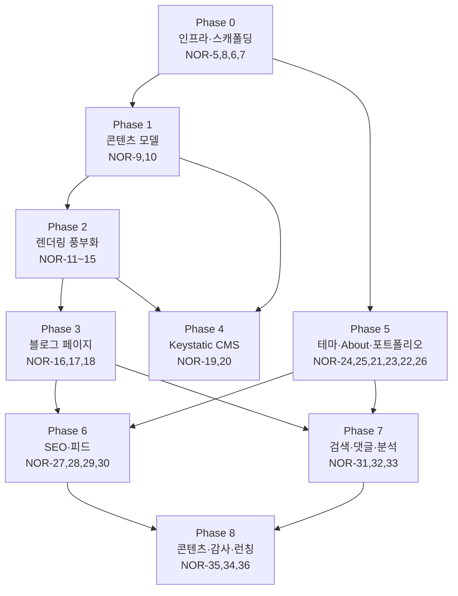

# Blog v4 — 작업 로드맵 (처리 순서)

> gze1206.net 블로그 재구축(v4)의 전체 일감과 **권장 처리 순서**를 정리한 문서입니다.
> 원본 일감(Single Source of Truth)은 Linear 프로젝트
> **[Blog v4 — gze1206.net](https://linear.app/noru-kim/project/6b1bec66-83eb-42f2-b910-ef84ca522d3d)** (팀 `NOR`)에 있으며, 이 문서는 그 순서를 사람이 읽기 쉽게 풀어 쓴 것입니다.

## 기술 스택 개요

- **프레임워크**: Astro (TypeScript strict) + Tailwind CSS
- **콘텐츠**: Content Collections + Markdoc, CMS는 Keystatic (로컬/GitHub 웹 에디터)
- **렌더링 차별점**: Shiki 기반 코드 하이라이팅(**.NET CIL/MSIL 커스텀 문법 포함**), KaTeX 수식, Mermaid 다이어그램, 커스텀 블럭(북마크·GitHub 카드·콜아웃)
- **UI**: 베이스 블로그 테마 + shadcn/ui React 아일랜드, 다크모드
- **배포**: GitHub → Cloudflare Pages 자동 배포, 커스텀 도메인 `gze1206.net`
- **부가**: Pagefind 검색(⌘K), Waline 댓글, Cloudflare Web Analytics, RSS/Sitemap, OG 이미지 자동생성(Satori), JSON-LD

## 처리 원칙

1. **아래 → 위로 쌓는다.** 인프라·콘텐츠 모델을 먼저 세우고 그 위에 렌더링·페이지·CMS·브랜딩을 얹는다.
2. **각 페이즈는 이전 페이즈의 산출물에 의존**한다. 같은 페이즈 안의 일감은 대체로 병렬 진행 가능하다.
3. **정적 우선 / 점진적 향상**: 크롤러가 읽는 정적 HTML을 먼저 만들고, 인터랙션(캔버스·아일랜드)은 나중에 얹는다.
4. Linear 우선순위(High/Medium/Low/Urgent)는 각 항목 옆에 표기했다. 순서가 상충하면 **의존성 > 우선순위**로 판단한다.

---

## Phase 0 — 인프라 & 스캐폴딩 (기반)

프로젝트가 존재하고 배포되는 최소 골격. 이후 모든 작업의 전제.

| 순서 | 일감 | 우선순위 | 요약 |
|---|---|---|---|
| 1 | [NOR-5](https://linear.app/noru-kim/issue/NOR-5) — Astro + TS 스캐폴딩 & Tailwind | High | `npm create astro`(TS strict) + Tailwind, 기본 레이아웃/폰트/reset, `astro build` 성공 |
| 2 | [NOR-8](https://linear.app/noru-kim/issue/NOR-8) — 프로젝트 규약: 린트·포맷·디렉토리 구조 | Medium | ESLint + Prettier + `.editorconfig`, `content/components/layouts/islands` 구조 합의 |
| 3 | [NOR-6](https://linear.app/noru-kim/issue/NOR-6) — GitHub 저장소 + Cloudflare Pages 자동 배포 | High | CF Pages ↔ GitHub 연동, push 시 preview/production 자동 빌드(`dist`) |
| 4 | [NOR-7](https://linear.app/noru-kim/issue/NOR-7) — 도메인 gze1206.net 연결 + 리다이렉트 | Medium | 커스텀 도메인 HTTPS, `blog.` → 정규 도메인 301, www 정규화 |

> NOR-5·8은 로컬에서 즉시 착수. NOR-6·7은 배포/도메인이 준비되면 진행(도메인 전파 대기 있으므로 일찍 시작하면 좋다).

## Phase 1 — 콘텐츠 모델 (데이터 계약)

글/시리즈/포트폴리오의 스키마와 렌더 파이프라인. 이후 페이지·CMS가 모두 여기에 묶인다.

| 순서 | 일감 | 우선순위 | 요약 |
|---|---|---|---|
| 5 | [NOR-9](https://linear.app/noru-kim/issue/NOR-9) — Content Collections 스키마 (posts·series·portfolio) | High | zod 스키마: posts(slug/category/tags/series/publishedAt/draft…), series, portfolio(stack/links) |
| 6 | [NOR-10](https://linear.app/noru-kim/issue/NOR-10) — Markdoc 통합 & 커스텀 태그 골격 | High | `@astrojs/markdoc` + 컬렉션 연결, 커스텀 태그/노드 등록 구조(북마크·github·callout 자리), 스모크 테스트 |

## Phase 2 — 콘텐츠 렌더링 풍부화 (Markdoc 태그·플러그인)

Phase 1의 파이프라인 위에서 실제 렌더링 기능을 채운다. 서로 독립적이라 병렬 가능.

| 순서 | 일감 | 우선순위 | 요약 |
|---|---|---|---|
| 7 | [NOR-11](https://linear.app/noru-kim/issue/NOR-11) — **Shiki + CIL(.NET) 커스텀 하이라이팅** | High | Shiki 통합 + CIL `.tmLanguage.json` 로드, 라이트/다크 대응 — **핵심 차별점** |
| 8 | [NOR-12](https://linear.app/noru-kim/issue/NOR-12) — 코드블럭 강화: 복사·파일명·라인·diff | Medium | 복사 버튼, `title=` 파일명, 라인 하이라이트 + diff, 접근성 |
| 9 | [NOR-13](https://linear.app/noru-kim/issue/NOR-13) — KaTeX 수식 + Mermaid | Medium | remark-math/rehype-katex, 빌드타임 Mermaid(다크·CLS 안정) |
| 10 | [NOR-14](https://linear.app/noru-kim/issue/NOR-14) — 미디어: 이미지 최적화 + 영상/YouTube | Medium | Astro `<Image>`(AVIF/WebP·lazy), 로컬 영상/YouTube 임베드, 캡션 |
| 11 | [NOR-15](https://linear.app/noru-kim/issue/NOR-15) — 커스텀 블럭: 북마크·GitHub 카드·콜아웃 | Medium | ``/``/`` — Keystatic 삽입 대비 태그 정의 |

## Phase 3 — 블로그 페이지 & 내비게이션

콘텐츠를 실제 라우트로 노출. Phase 1 스키마 + Phase 2 렌더링에 의존.

| 순서 | 일감 | 우선순위 | 요약 |
|---|---|---|---|
| 12 | [NOR-16](https://linear.app/noru-kim/issue/NOR-16) — 목록/상세 + 카테고리·태그·시리즈 페이지 | High | `/blog`(페이지네이션), `/blog/[slug]`, `/category`·`/tags`·`/series`, draft 제외 |
| 13 | [NOR-17](https://linear.app/noru-kim/issue/NOR-17) — 글 상세: TOC+앵커, 읽기시간, 작성/수정일 | Medium | 헤딩 앵커·목차, 읽기시간, 날짜(JSON-LD 대비) |
| 14 | [NOR-18](https://linear.app/noru-kim/issue/NOR-18) — 시리즈 내비게이션 (이전/다음 편) | Medium | 시리즈 목록·순서, 이전/다음 이동, 진행도(N/총) |

## Phase 4 — CMS (Keystatic)

작성 워크플로. Phase 1 스키마 + Phase 2 커스텀 블럭 태그에 의존.

| 순서 | 일감 | 우선순위 | 요약 |
|---|---|---|---|
| 15 | [NOR-19](https://linear.app/noru-kim/issue/NOR-19) — Keystatic 설치·구성 (컬렉션 매핑) | High | Keystatic + Astro 통합, posts/series/portfolio 매핑, 로컬 모드 CRUD |
| 16 | [NOR-20](https://linear.app/noru-kim/issue/NOR-20) — Keystatic 웹 에디터 + 커스텀 블럭 삽입 UI | Medium | GitHub 모드 웹 에디터(폰/태블릿), 북마크·GitHub·콜아웃 삽입, 이미지 업로드 경로 |

## Phase 5 — 테마 · 브랜딩 · About/포트폴리오

시각 정체성과 루트 페이지(경력 서사). NOR-24는 이르게 착수해도 좋으나, 콘텐츠 구조가 잡힌 뒤 확정하는 편이 안전하다.

| 순서 | 일감 | 우선순위 | 요약 |
|---|---|---|---|
| 17 | [NOR-24](https://linear.app/noru-kim/issue/NOR-24) — 베이스 테마 채택 + Tailwind 토큰 커스터마이즈 | High | 블로그 테마 뼈대 채택, 색/타이포/spacing 토큰 브랜딩, 본문 가독성 확정 |
| 18 | [NOR-25](https://linear.app/noru-kim/issue/NOR-25) — shadcn/ui 아일랜드 + 다크모드 토글 | Medium | React 아일랜드 + shadcn(필요 지점 한정), 다크/라이트(FOUC 방지), Shiki·Waline 테마 동기화 |
| 19 | [NOR-21](https://linear.app/noru-kim/issue/NOR-21) — About/포트폴리오 정보구조 + SEO 텍스트 레이어 | High | 경력·역할·성과·스택을 정적 HTML로, 시맨틱 + Person JSON-LD 대비, 인터랙션 폴백 |
| 20 | [NOR-23](https://linear.app/noru-kim/issue/NOR-23) — 포트폴리오 항목 데이터화 + 외부 링크 | Medium | portfolio 컬렉션 렌더, 항목별 repo/demo/video/article 링크(`rel=noopener`) |
| 21 | [NOR-22](https://linear.app/noru-kim/issue/NOR-22) — 인터랙티브 캔버스 레이어 (점진적 향상) | Medium | Three.js/Phaser 아일랜드(`client:visible`), 저사양 폴백·`prefers-reduced-motion`, 지연 로드 |
| 22 | [NOR-26](https://linear.app/noru-kim/issue/NOR-26) — 커스텀 404 + a11y 기본기 | Medium | 커스텀 404, 시맨틱 랜드마크·키보드 포커스·대비(WCAG AA), skip-link/alt 규약 |

## Phase 6 — SEO & 배포 메타

콘텐츠·페이지가 존재해야 의미 있는 메타/피드. Phase 3·5에 의존.

| 순서 | 일감 | 우선순위 | 요약 |
|---|---|---|---|
| 23 | [NOR-27](https://linear.app/noru-kim/issue/NOR-27) — 메타 위생: title/description/canonical/robots/OG | High | 페이지별 메타, canonical/robots/`lang=ko`, OG/Twitter 공통 컴포넌트 |
| 24 | [NOR-28](https://linear.app/noru-kim/issue/NOR-28) — OG 이미지 자동생성 (Satori) | Medium | 제목/시리즈/브랜드로 빌드타임 생성, 한글 폰트 임베드, 목록/글/About 템플릿 |
| 25 | [NOR-29](https://linear.app/noru-kim/issue/NOR-29) — JSON-LD (Article/Breadcrumb/Person) | Medium | 글 Article/BlogPosting, BreadcrumbList, About Person, 리치결과 테스트 |
| 26 | [NOR-30](https://linear.app/noru-kim/issue/NOR-30) — RSS/Atom 피드 + 사이트맵 | Medium | `@astrojs/rss`, `@astrojs/sitemap`, robots.txt에 sitemap 참조 |

## Phase 7 — 검색 · 참여 · 분석

핵심 사이트가 완성된 뒤 얹는 부가 기능. 병렬 가능.

| 순서 | 일감 | 우선순위 | 요약 |
|---|---|---|---|
| 27 | [NOR-31](https://linear.app/noru-kim/issue/NOR-31) — Pagefind 검색 + 커맨드팔레트 | Medium | Pagefind 빌드 인덱스, shadcn ⌘K 팔레트, 결과 하이라이트/키보드 |
| 28 | [NOR-32](https://linear.app/noru-kim/issue/NOR-32) — Waline 댓글 연동 | Medium | 서버리스 Waline 배포, 글 상세 임베드(로그인 불필요·다크 동기화), i18n(ko)·스팸 방지 |
| 29 | [NOR-33](https://linear.app/noru-kim/issue/NOR-33) — Cloudflare Web Analytics | Low | 쿠키리스 토큰 삽입, 프로덕션 트래킹 확인 |

## Phase 8 — 마무리 & 런칭

| 순서 | 일감 | 우선순위 | 요약 |
|---|---|---|---|
| 30 | [NOR-35](https://linear.app/noru-kim/issue/NOR-35) — 첫 글 작성 + About 콘텐츠 채우기 | High | 첫 글 1편(가급적 "블로그 재구축기"), About/포트폴리오 실제 경력·프로젝트, 대표 이미지/OG |
| 31 | [NOR-34](https://linear.app/noru-kim/issue/NOR-34) — 성능(CWV)·접근성 최종 감사 | High | Lighthouse LCP/CLS/INP 목표 통과, axe 이슈 해소, 번들/이미지 예산 |
| 32 | [NOR-36](https://linear.app/noru-kim/issue/NOR-36) — 최종 QA 체크리스트 & 프로덕션 배포 | Urgent | 링크·리다이렉트·404·RSS·사이트맵·OG 검증, 크로스브라우저, 배포 + GSC 등록 |

---

## 의존성 요약 (Mermaid)

## 병렬화 힌트

- **Phase 0 착수 직후** NOR-6(배포)·NOR-7(도메인 전파)은 백그라운드로 돌려두고 로컬 개발을 이어간다.
- **Phase 2**의 5개 일감(NOR-11~15)은 서로 독립 — 병렬 진행 가능.
- **Phase 5** 테마(NOR-24)는 원하면 Phase 0 직후 시작해 다른 페이즈와 병렬로 다듬어도 된다.
- **Phase 6·7**은 Phase 3(페이지)와 Phase 5(About)가 끝난 시점부터 대부분 병렬 진행 가능.
