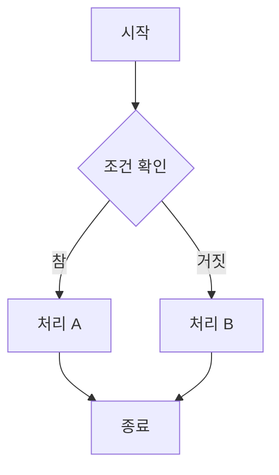
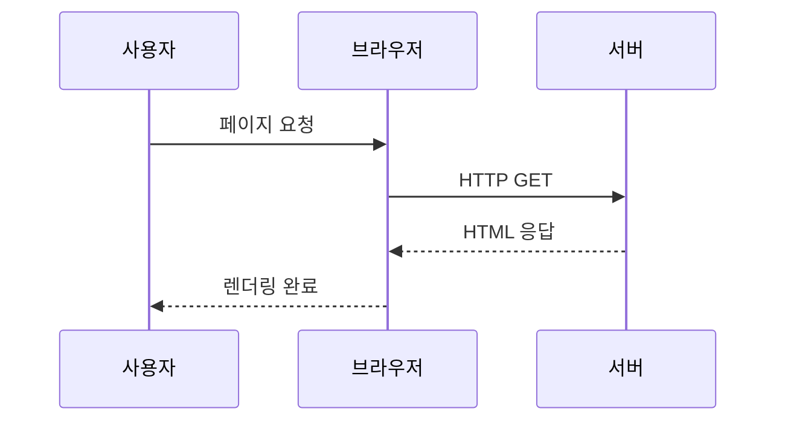

# 수식 테스트

## 인라인 수식

아인슈타인의 유명한 공식 $E = mc^2$ 은 질량-에너지 등가를 나타낸다.

이차방정식의 근의 공식은 $x = \frac{-b \pm \sqrt{b^2 - 4ac}}{2a}$ 이다.

## 블록 수식

오일러 항등식:

$$
e^{i\pi} + 1 = 0
$$

가우스 적분:

$$
\int_{-\infty}^{\infty} e^{-x^2} \, dx = \sqrt{\pi}
$$

행렬 표현:

$$
\begin{pmatrix}
a & b \\
c & d
\end{pmatrix}
\begin{pmatrix}
x \\
y
\end{pmatrix}
=
\begin{pmatrix}
ax + by \\
cx + dy
\end{pmatrix}
$$

# 다이어그램 테스트

## 플로차트

## 시퀀스 다이어그램

# 혼합 테스트

수식 $f(x) = \sum_{n=0}^{\infty} \frac{f^{(n)}(a)}{n!}(x-a)^n$ 과 다이어그램이 같은 페이지에서 공존하는지 확인한다.
